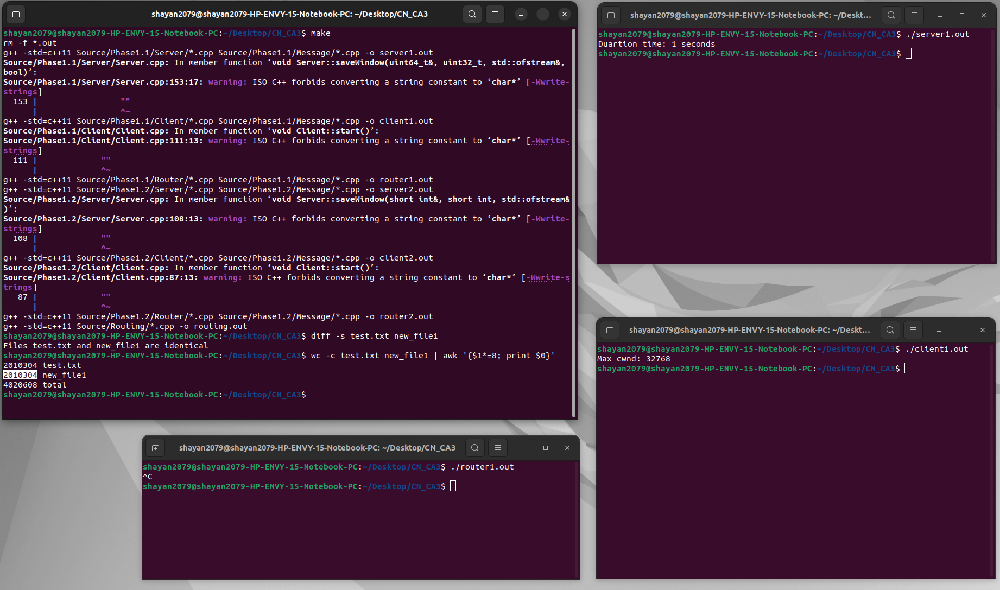

# سوالات
1. در پروتکل tcp کلاینت و سرور باید یک کانکشن پایدار ایجاد کنند تا از طریق آن پکت ها را بفرستند . در این پروتکل پکت های لاست شده دوباره فرستاده میشوند و میشود اطمینان داشت که همه پکت ها به صورت درست و کامل به مقصد میرسند.

در پروتکل udp فرستنده بدون ایجاد کانکشن پکت ها را میفرستد و ما نمیتوانیم از رسیدن پکت ها به گیرنده مطمین شیم.

به دلیل سریع بودن udp از آن در جاهایی که نیازی نیست دیتا را حتما کامل بگیریم استفاده میشود مانند بازی های آنلاین و در بقیه جاها مانند دانلود کردن محتوای یک فایل از tcp استفاده میشود.

2. Go-Back-N: فرستنده به ازای هر پنجره ای که میفرستد فقط یک ack میگیرد. گیرنده پکت های خارج از ترتیب را فبول نمیکند. در صورتی که پکتی ترسد باید کل پنجره دوباره ارسال شود.

Selective-Repeat: فرستنده به ازای هر پکتی که میفرستد ack دریافت میکند. گیرنده پکت های خارج از ترتیب را قبول میکند. در صورتی که پکت نرسد تنها همان پکت دوباره ارسال خواهد شد. از پروتکل اول پیچیده تر است.

3. روتر ها میتوانند فقط هزینه مسیری که تغییر کرده است را در جدول درست کنند و جدول را برای همدیگر بفرستند تا زمانی که دیگر جداول اصلاح نشوند.

4. پروتکل dvrp ترافیک کمتری در شبکه ایجاد میکند و پهنای باند کمتری میخواهد ولی نسبت به تغییرات کندتر است و ممکن است وارد لوپ بینهایت شود در حالی که lsrp ترافیک بیشتری ایجاد میکند ولی نسبت به تغییرات سریع تر است و وارد لوپ بینهایت نمیشود.

5. RED: ممکن است از تمام فضای گیرنده استفاده نکند. سایز پکت ها کمتر است. به پهنای باند کمتری نیاز دارد.

ECN: سایز پکت ها برای فرستادن اطلاعات شبکه بیشتر میشود. به پهنای باند بیشتری نیاز دارد. ممکن است یک فرستنده بیشتر ترافیک شبکه را بگیرد.

# بخش اول 

### فاز اول
ابتدا باید router1.out اجرا شود سپس server1.out و بعد client1.out

کلاینت فایل test.txt را برای سرور میفرستد و سرور آن را در new_file1 ذخیره میکند

کلاینت از cwnd = 1 شروع میکند و پکت ها را به روتر میفرستد.

روتر پکت های که میگیرد را بررسی میکند. اگر پکت ack بود آن را برای کلاینت میفرستد و اگر نبود آن را برای سرور میفرستد.

سرور پکت های گرفته شده را در یک پنجره ذخیره میکند و پس از اینکه پنجره کامل شد یک پیام ack برای کلاینت میفرستد و پنجره را در فایل ذخیره میکند.

تصویر اجرای برنامه

### فاز دوم
ابتدا باید router2.out اجرا شود سپس server2.out و بعد client2.out

کلاینت فایل test.txt را برای سرور میفرستد و سرور آن را در new_file2 ذخیره میکند

روتر مانند قسمت قبل کار میکند غیر از اینکه اکنون اندازه بافر آن پنج است و همچنین قبل از فرستادن پکت ها هم دیلی دارد

کلاینت بعد از فرستادن هر پنجره منتظر ack آن میماند و اگر آن را دریافت نکرد دوباره پنجره را میفرستد

سرور بعد از دریافت هر پکت با توجه به آیدی پکت آن را در پنجره ذخیره میکند و بعد از کامل شدن پنجره پیام ack را میفرستد

#### تصویر اجرای برنامه

